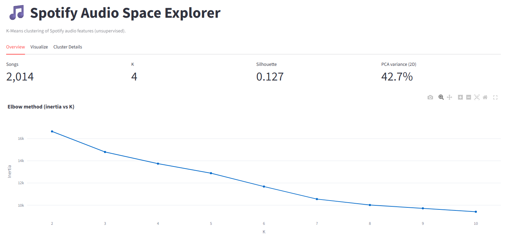
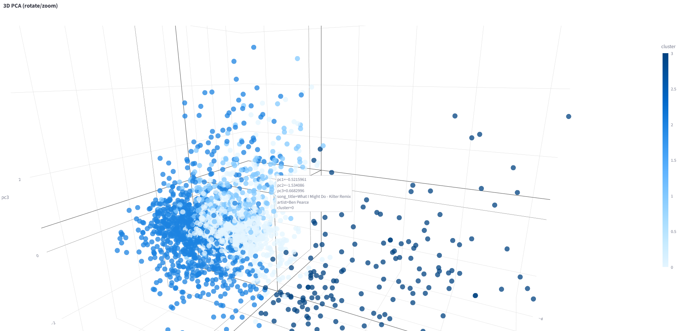

# Spotify Audio Space Explorer

**Discovering Latent Musical Structure Through Unsupervised Learning**

---

## Overview

Spotify Audio Space Explorer is an interactive machine learning application that applies **K-Means clustering** to acoustic feature representations of songs in order to uncover latent structural groupings in music without relying on genre labels.
Rather than clustering songs by artist, playlist, or predefined categories, this project uses only Spotify’s low-level audio features such as energy, danceability, valence, tempo, and acousticness. The objective is to investigate whether meaningful musical structure emerges naturally from numerical representations of these songs alone.

You can play around with the tool yourself here: [Spotify Audio Space Explorer](https://spotify-song-clustering.streamlit.app/)

---

## Dashboard Preview

### Overview Panel



---

### 3D PCA Cluster Visualization



---

### Cluster Comparison Heatmap


---

### Cluster Cards with Audio Previews


---

## Dataset

The dataset used for this project is the [Spotify Song Attributes](https://www.kaggle.com/datasets/geomack/spotifyclassification) dataset from Kaggle. Itconsists of ~1,500 Spotify tracks with the following acoustic features:

* acousticness: A confidence measure from 0.0 to 1.0 of whether the track is acoustic.
* danceability: A score describing how suitable a track is for dancing based on tempo, rhythm stability, beat strength and overall regularity.
* duration_ms: The length of the track in milliseconds.
* energy: A measure of intensity and activity. Typically, energetic tracks feel fast, loud, and noisy.
* instrumentalness: The likelihood a track contains no vocals. Values closer to 1.0 suggest solely instrumental tracks.
* liveness: The likelihood of a track being performed live. Higher values suggest more audience presence.
* loudness: The overall loudness of a track in decibels (dB). Higher values indicate louder tracks overall.
* speechiness: Measures the presence of spoken words.
* tempo: The speed of a track, measured in beats per minute (BPM).
* valence: The overall musical positiveness(emotion) of a track. High valence sounds happy; low valence sounds sad or angry.

Each track also includes its title and artist for display purposes.

---

## Methodology

### Feature Preparation

Each track is represented as a 10-dimensional feature vector.

Since features operate on different scales (for example, `tempo` vs. `acousticness`), all variables are standardized using:

```
StandardScaler()
```

This ensures equal contribution of each feature to Euclidean distance calculations within K-Means.

The result is a normalized feature space where the closer two data points (songs) are in the projected space (2D/3D), the more acoustically similar they are.

---

### Clustering with K-Means

Clustering is performed using:

```
KMeans (scikit-learn implementation)
```

K-Means partitions the feature space by minimizing within-cluster variance.
Songs assigned to the same cluster are acoustically closer in standardized space than songs in different clusters.

---

### Selecting the Number of Clusters

To avoid arbitrary cluster counts, two evaluation metrics are used:

#### Elbow Method

Plots inertia (within-cluster sum of squares) across multiple K values.
The "elbow" indicates diminishing returns in reducing internal variance.

#### Silhouette Score

Measures how well each song fits within its assigned cluster compared to neighboring clusters.

Silhouette values close to 1 indicate clear separation; values near 0 indicate overlapping clusters.

These two methods provide empirical support for choosing K.

---

### Dimensionality Reduction

The original dataset lives in a 10-dimensional feature space.
To visualize it meaningfully, Principal Component Analysis (PCA) is applied.

Two projections are provided:

* **2D PCA** for compact inspection
* **3D PCA (interactive)** for richer spatial exploration

The explained variance ratio is displayed so users understand how much structural information is retained in the projection.

While PCA is a linear transformation and does not preserve all variance, it provides a useful approximation of cluster separation in lower dimensions.

---

## Cluster Interpretation

Clusters are not labeled using predefined genres.

Instead, each cluster is described by comparing its feature means against global dataset averages. Feature deviations are computed using z-scores, allowing identification of statistically significant characteristics.

This produces concise, neutral descriptions such as:

* **High energy · High tempo · Low acousticness**
* **High acousticness · Low loudness**
* **High valence · High danceability**

These labels are derived entirely from numerical distributions and avoid subjective tagging.

Cluster-level heatmaps further illustrate how segments differ relative to global averages.

---

## Interactive Components

The dashboard is designed to connect statistical output with intuitive understanding.

Users can:

* Rotate and zoom a 3D projection of cluster space
* Select arbitrary feature pairs for direct comparison
* Search for specific songs and identify their cluster membership
* View nearest neighbors in acoustic feature space
* Listen to 30-second previews to qualitatively assess cluster consistency
* Download clustering results as a CSV

---

## What This Project Demonstrates

This project explores:

* End-to-end application of unsupervised learning
* Proper feature scaling and preprocessing
* Empirical model validation (elbow + silhouette)
* Dimensionality reduction for high-dimensional data
* Statistical interpretation of clusters

More broadly, it demonstrates how structure can emerge from purely numerical representations — even in complex domains like music — without relying on categorical labels.

---

## Project Structure

```
spotify_cluster/
    data.py         → dataset loading & validation
    model.py        → clustering logic & evaluation
    ui.py           → visualization functions
    previews.py     → audio preview integration
app.py              → Streamlit application entry point
```

---

## Running the Application Locally

Install dependencies:

```bash
pip install streamlit pandas numpy scikit-learn plotly requests
```

Place the dataset at:

```
data/spotify.csv
```

Run:

```bash
streamlit run app.py
```
