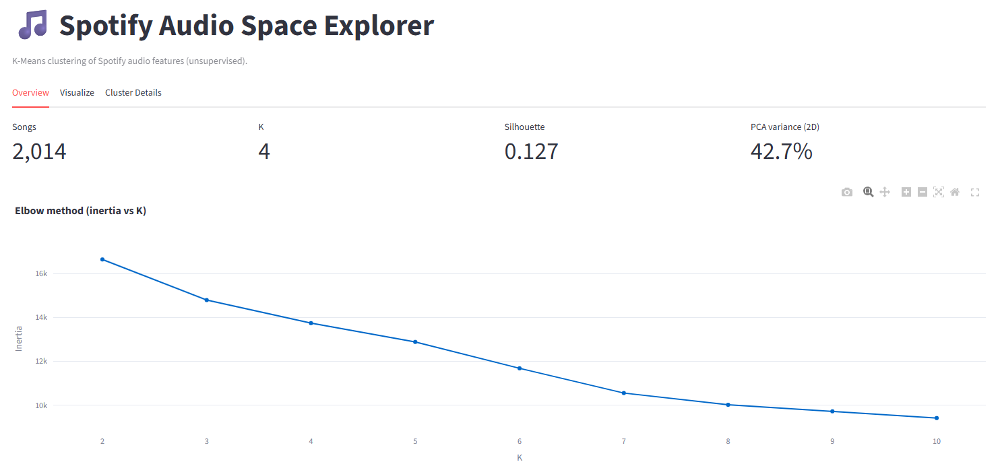
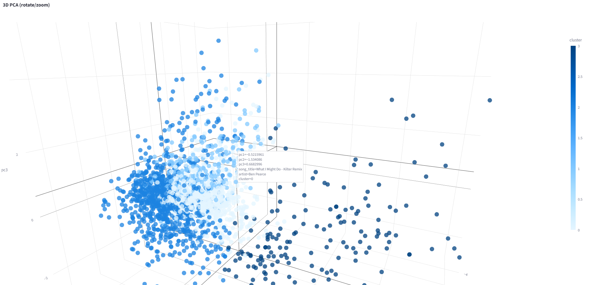
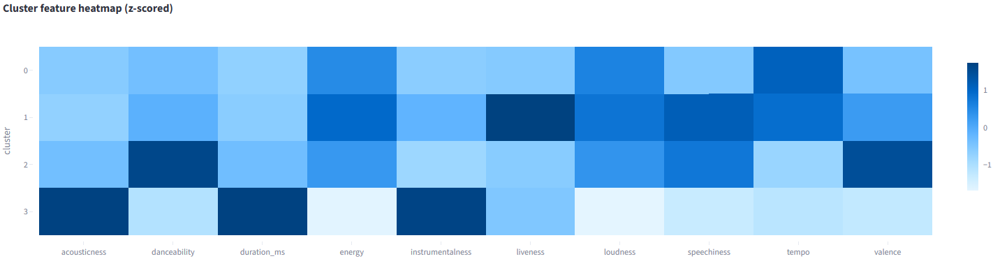
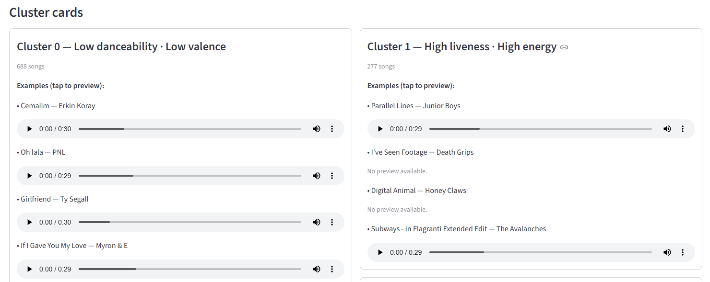

# Spotify Audio Space Explorer

> Interactive Streamlit dashboard that clusters ~1,500 Spotify tracks by acoustic features using K-Means without any genre labels.


---

## Table of Contents

- [Overview](#overview)
- [Demo](#demo)
- [Features](#features)
- [Tech Stack](#tech-stack)
- [Getting Started](#getting-started)
  - [Prerequisites](#prerequisites)
  - [Installation](#installation)
  - [Running the App](#running-the-app)
- [Usage](#usage)
- [Project Structure](#project-structure)
- [Contributing](#contributing)
- [License](#license)

---

## Overview

**Spotify Audio Space Explorer** explores latent structural groupings hidden in songs without needing predefined genre labels or playlists.

The app uses **K-Means clustering** (scikit-learn) applied to Spotify's low-level audio features (energy, danceability, valence, tempo, acousticness, and more) to partition ~1,500 tracks into user-defined clusters. Features are first standardized with `StandardScaler` so that every dimension contributes equally to Euclidean distance. Two evaluation metrics (the **elbow method** and the **silhouette score**) guide the choice of K, and **PCA** reduces the 10-dimensional feature space to 2D/3D for visualization. Cluster descriptions are generated automatically from z-score deviations (e.g. *High energy · Low acousticness*) without any subjective tagging.

This project looks at how unsupervised machine learning can be used to discover meaningful musical structure from purely numerical feature representations.

---

## Demo

### Overview Panel (Metrics & Elbow Graph)


### 3D PCA Cluster Visualization


### Cluster Comparison Heatmap


### Cluster Cards with Audio Previews


> **Try it live:** [spotify-song-clustering.streamlit.app](https://spotify-song-clustering.streamlit.app)

*The screenshots above show (top to bottom): the sidebar controls and elbow plot used to select K; an interactive 3D PCA scatter coloured by cluster; a z-score heatmap comparing cluster feature profiles; and expandable cluster cards listing representative songs with 30-second audio previews.*

---

## Features

- Choose the number of clusters K (2–10) with a slider and click **Analyze**
- Elbow plot and silhouette score to empirically validate the chosen K
- Interactive 3D PCA scatter plot (rotatable, zoomable) coloured by cluster assignment
- 2D feature scatter for arbitrary pairwise comparisons
- Cluster heatmap showing z-score deviations from global feature averages
- Auto-generated cluster labels derived purely from numerical distributions
- Per-cluster cards listing top representative songs with 30-second iTunes audio previews
- Download the full clustering results as a CSV

---

## Tech Stack

| Layer | Technology |
|-------|------------|
| UI | Streamlit |
| Data | pandas, NumPy |
| ML | scikit-learn (KMeans, PCA, StandardScaler) |
| Visualization | Plotly |
| Audio Previews | iTunes Search API |

---

## Getting Started

### Prerequisites

- Python 3.9+
- pip

### Installation

```bash
# 1. Clone the repository
git clone https://github.com/TheInvadr/song-clustering.git
cd song-clustering

# 2. (Recommended) Create and activate a virtual environment
python -m venv venv
# Windows
venv\Scripts\activate
# macOS / Linux
source venv/bin/activate

# 3. Install dependencies
pip install -r requirements.txt
pip install streamlit
```

The dataset (`data/spotify.csv`) is already included in the repository.

### Running the App

```bash
streamlit run app.py
```

The app will open automatically in your browser at `http://localhost:8501`.

---

## Usage

1. Open the **sidebar** on the left.
2. Use the **Clusters (K)** slider to choose a number of clusters between 2 and 10.
3. Toggle **3D PCA** on or off depending on whether you want an interactive 3D scatter or a 2D view.
4. Click **Analyze** to run the clustering pipeline.
5. Browse the three tabs:
   - **Overview**: key metrics (song count, K, silhouette score, PCA variance) and the elbow plot.
   - **Visualize**: interactive PCA scatter and pairwise feature scatter.
   - **Cluster Details**: per-cluster heatmap, auto-generated labels, representative songs, and audio previews.
6. Expand any cluster card to listen to 30-second previews and assess cluster quality qualitatively.
7. Download the labelled dataset using the **Download CSV** button.

---

## Project Structure

```
.
├── app.py                    # Streamlit entry point
├── requirements.txt          # Python dependencies
├── data/
│   └── spotify.csv           # Kaggle Spotify Song Attributes dataset (~1,500 tracks)
├── cache/
│   └── previews_itunes.json  # Cached iTunes preview URLs
├── spotify_cluster/
│   ├── data.py               # Dataset loading & validation
│   ├── model.py              # Clustering logic, PCA, and evaluation metrics
│   ├── ui.py                 # Plotly visualization functions
│   └── previews.py           # iTunes audio preview integration
├── Screenshots/              # Dashboard screenshots used in this README
└── README.md
```

---

## Contributing

1. Fork the repository.
2. Create a feature branch: `git checkout -b feature/your-feature`.
3. Commit your changes: `git commit -m "Add your feature"`.
4. Push to your fork: `git push origin feature/your-feature`.
5. Open a Pull Request describing what you changed and why.

---

## License

This project is licensed under the [MIT License](LICENSE).